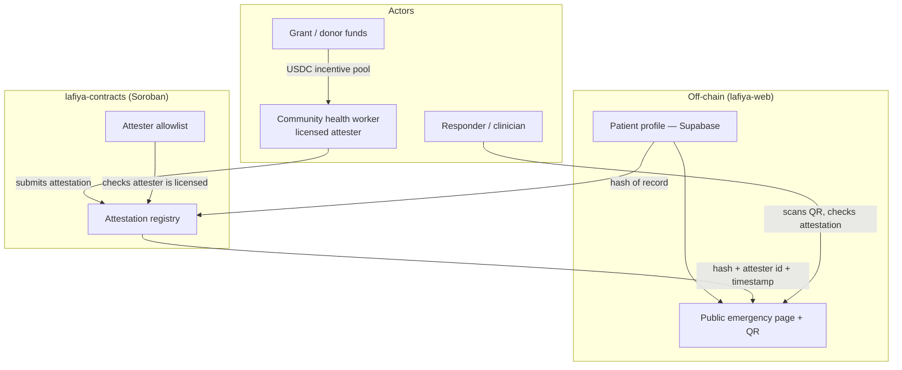

# Lafiya 🔏

[](https://stellar.org)
[](https://soroban.stellar.org)
[]()
[]()

Soroban smart contracts for Lafiya's on-chain trust layer — an attestation registry and attester allowlist that let a health worker's verification of an emergency health record be checked cryptographically, without the underlying health data ever touching the blockchain.

**Your vitals, verified. When you can't speak, Lafiya does.**

*Lafiya* is Hausa for health, safety, and wellbeing.

> **Status:** Pre-alpha · Stellar **testnet** · not yet audited · not a medical device. See [Disclaimer](#disclaimer).

## Overview

Lafiya is a free, patient-owned emergency health card: the handful of facts that change how you are treated in an emergency — blood group, genotype, allergies, current medications, chronic conditions — travel with you as a scannable QR code and can be **cryptographically verified** by a health worker so a first responder can trust them on the spot.

This repository (`lafiya-contracts`) contains only the Soroban smart contract layer. The patient-facing web app and the docs/threat-model materials live in separate repos — see [Lafiya Organization](#lafiya-organization) below.

### The Problem

In Nigeria, health records are paper, siloed per facility, and effectively lost the moment a patient moves, is referred, or arrives unconscious. In an emergency, the facts that decide treatment — especially **genotype** (AS/SS sickle-cell status), blood group, and drug allergies — are usually unknown to whoever is treating you, and wrong assumptions cost lives.

Even once that data is digitized (in `lafiya-web`), a responder still has no way to know whether a card's contents were ever checked by a real health worker. Without an independent, tamper-evident verification layer:

- **Responders can't trust the data** — anyone could edit a public emergency page, so a "verified" label is meaningless unless it's backed by something the patient (or an attacker) can't forge
- **Health workers have no portable proof of their verification work** — nothing links a specific attester to a specific record across systems
- **Community health workers (CHWs) can't be paid reliably** for last-mile registration and verification without a transparent, low-fee settlement rail

### What `lafiya-contracts` Does

- **Attests** — records, on-chain, that a licensed health worker verified a specific patient record at a specific time, without storing any health data itself
- **Allowlists** — maintains the set of health workers authorized to submit attestations, so a "verified" indicator on a card actually means something
- **Anchors trust** — gives `lafiya-web` and `lafiya-verifier` a single, independently checkable source of truth that a responder's QR scan can query directly

## Features

- **Attestation registry (Soroban)** — when a licensed health worker verifies a record, an on-chain attestation stores *a hash of the record + the attester's identity + a timestamp* — never the health data itself
- **Attester allowlist** — only allowlisted attesters can write to the registry, so verification can't be forged by an arbitrary wallet
- **Hash-only on-chain footprint** — personal data lives in `lafiya-web`'s encrypted, access-controlled off-chain database; Stellar holds only hashes, attestations, and payments
- **USDC incentive rails** — CHWs are paid micro-amounts on Stellar per verified registration; near-zero fees and stablecoin settlement make last-mile outreach economically viable
- **Transparent funding** — grant and donor funds flow on-chain into the CHW incentive pool, so every dollar maps to a countable number of verified cards

## Architecture



### Core Components

- **Attestation registry** — the on-chain record that a specific attester verified a specific record's hash at a specific time
- **Attester allowlist** — the on-chain list of health workers authorized to write attestations

Both are targeted for milestone **M1** (see [Roadmap](#roadmap)); this repository is currently pre-alpha with no contract code yet.

## Smart Contract Layer (planned)

The Soroban contracts here are the on-chain truth layer for Lafiya attestations — described at the level the project's roadmap and design principle currently commit to; exact function signatures are not yet finalized.

**Design principle:** no personal health data ever touches the blockchain. Personal data lives in `lafiya-web`'s encrypted, access-controlled off-chain database. Stellar holds only hashes, attestations, and payments. This is what keeps Lafiya both privacy-respecting and regulator-compatible.

Conceptually, the registry needs to:

1. Accept an attestation from a caller, consisting of a record hash, the attester's identity, and a timestamp
2. Reject attestations from callers not present in the attester allowlist
3. Allow any caller (e.g. `lafiya-web` rendering a public emergency page) to look up whether — and by whom — a given record hash was attested

## Repository Structure

This repository is pre-alpha and does not yet contain contract code. Once M1 lands, the Soroban attestation registry and attester allowlist contracts — along with their tests — will live here.

## Tech Stack

- **On-chain:** Soroban smart contracts (Rust) on Stellar; USDC on Stellar for CHW payments
- **Network:** Stellar testnet first
- **Standards informing design:** W3C Verifiable Credentials data model (issuer/holder/verifier roles, hash-based attestation)

## Getting Started

Pre-alpha; this repository has no contract code yet. Setup instructions land with milestone M1 (see [Roadmap](#roadmap)).

## Privacy & Compliance

- **Nigeria Data Protection Act (2023)** governs all personal data held across the Lafiya project. Consent, encryption, and minimal disclosure are designed in from day one.
- No health data is ever written on-chain — only non-reversible hashes and attestations, by design (see [Smart Contract Layer](#smart-contract-layer-planned)).

## Roadmap

- **M0 — Public card (testnet).** One patient can create a profile and expose a working read-only emergency page via QR. *(`lafiya-web`)*
- **M1 — Attestation.** Soroban registry lets an allowlisted attester verify a record; the card shows a verified indicator. **← this repo**
- **M2 — Incentives.** USDC-on-Stellar payout to a CHW per verified registration.
- **M3 — Pilot.** Small supervised field pilot; measure verified cards created and scan events.
- **M4 — Mainnet + funding.** Launch on mainnet; open transparent funding pool.

## Why This Matters for the Stellar Ecosystem

Stellar/Soroban does two things Lafiya genuinely needs that a plain web app cannot: it makes verification **tamper-evident and independently checkable** without exposing data, and it moves **stablecoin micropayments** to health workers cheaply and across borders. Remove Stellar and the trust layer and the incentive engine both disappear — Soroban is core to Lafiya, not shoehorned in.

## Testing

No tests yet. Contract tests land alongside the attestation registry and attester allowlist implementation (M1).

## Dependencies

- Rust + Soroban SDK (planned, once M1 contract work begins)
- Stellar testnet account and USDC trustline for local development

## License

Recommended: **Apache-2.0** (OSI-approved, includes a patent grant — required for Digital Public Good status). Not yet finalized project-wide.

## Contributing

Issues and PRs welcome once M0/M1 land. Contributors agree to the project's code of conduct and license terms. This repository specifically needs collaborators with experience in:

- Stellar / Soroban smart contract development (Rust)
- On-chain data modeling and attestation/verifiable-credential design

## Lafiya Organization

This repo is one of five in the `lafiya-xyz` organization.

| Repo                  | Purpose                                                                                              | Priority                 |
| ---------------------- | ----------------------------------------------------------------------------------------------------- | ------------------------- |
| `lafiya-web`           | Patient + responder web app (Next.js). Public emergency page, authed profile editor, QR generation.    | Build first               |
| **`lafiya-contracts`** _(this repo)_ | Soroban smart contracts (Rust): attestation registry + attester allowlist. Testnet first. | **Build next**            |
| `lafiya-docs`          | Concept note, data model, threat model, privacy design, funding/DPG materials, references.             | Start now (lightweight)   |
| `.github`              | Organization profile README and contribution guidelines.                                               | Start now                 |
| `lafiya-verifier`      | CHW verification tool. Begins as a route inside `lafiya-web`; split out only if it grows.               | Later                     |

> Resist scaffolding empty repos. Two working repos (`lafiya-web`, `lafiya-contracts`) beat five half-built ones. Build one honest milestone at a time.

### Data Flow

```
lafiya-web  ──(record hash)──▶  lafiya-contracts
                                       │
        CHW attests ──(licensed?)──▶  │  (attester allowlist check)
                                       ▼
                          attestation: hash + attester id + timestamp
                                       │
                                       ▼
                              lafiya-web public emergency page
                                       │
                                       ▼
                         responder scans QR, sees verified indicator
```

1. **`lafiya-web`** holds the patient's private profile and computes a hash of the emergency-relevant record.
2. A licensed CHW, verified against the **attester allowlist**, submits an attestation to the **attestation registry** in this repo — a hash, the attester's identity, and a timestamp, never the health data itself.
3. **`lafiya-web`**'s public emergency page reads the attestation to show a verified indicator; a responder scanning the QR can independently trust it without an external oracle.
4. **`lafiya-verifier`** (later) gives CHWs a dedicated flow for step 2 as it splits out of `lafiya-web`.

### Shared Contracts (must stay in sync across repos)

**Attestation schema** — a hash of the record + the attester's identity + a timestamp, defined by the contracts in this repo and consumed by `lafiya-web`'s public emergency page. If the shape of an attestation changes here, `lafiya-web`'s verification-display logic must be updated in the same change set (or a tracked follow-up opened there).

### Conventions for AI Agents

- Treat this section as the source of truth for **cross-repo** contracts. Each repo's own README covers repo-local conventions.
- This repo is pre-alpha: do not assume contract code, tests, or a build system exist yet — check before referencing paths that aren't in [Repository Structure](#repository-structure).
- When a change here affects the attestation schema, call it out explicitly so `lafiya-web` can be updated to match.

## Support

For issues and questions:

- GitHub Issues: [Create an issue](https://github.com/Lafiya-xyz/Lafiya-contract/issues)

## Disclaimer

Lafiya is an information aid, **not a medical device** and **not a substitute for professional medical judgment**. Verified indicators reflect that a record was attested by a registered health worker; they are not a clinical guarantee. Treatment decisions remain the responsibility of the attending clinician.

## References

These works directly informed Lafiya's design and are the intended reading for contributors, particularly the attestation/trust-layer work in this repo.

**Books**

- Preukschat, A., & Reed, D. (2021). *Self-Sovereign Identity: Decentralized Digital Identity and Verifiable Credentials*. Manning. — The blueprint for Lafiya's attestation layer: issuer/holder/verifier roles, verifiable credentials, hash-based attestation, key management, and offline verification.
- Kleppmann, M. (2017). *Designing Data-Intensive Applications*. O'Reilly. — Informs the boundary between what lives in the off-chain database and what is anchored on-chain.
- Martin, R. C. (2017). *Clean Architecture: A Craftsman's Guide to Software Structure and Design*. Prentice Hall. — Discipline for an AI-assisted codebase: clear boundaries so the contracts, app, and data layer stay independently maintainable.
- Shortliffe, E. H., & Cimino, J. J. (Eds.). (2021). *Biomedical Informatics: Computer Applications in Health Care and Biomedicine* (5th ed.). Springer. — Grounds which fields are decision-relevant in an emergency, informing what a record hash here actually represents.
- Toyama, K. (2015). *Geek Heresy: Rescuing Social Change from the Cult of Technology*. PublicAffairs. — Keeps the project honest: the attestation layer amplifies trust in community health workers rather than replacing them.

**Standards & documentation**

- Stellar Development Foundation — Stellar and Soroban developer documentation.
- W3C — Verifiable Credentials Data Model.
- Nigeria Data Protection Act (2023) — Nigeria Data Protection Commission.
- Digital Public Goods Alliance — DPG Standard.

---

<div align="center">

**Lafiya** — Your vitals, verified.

_Built for the Stellar ecosystem. Open source. Community owned._

</div>
