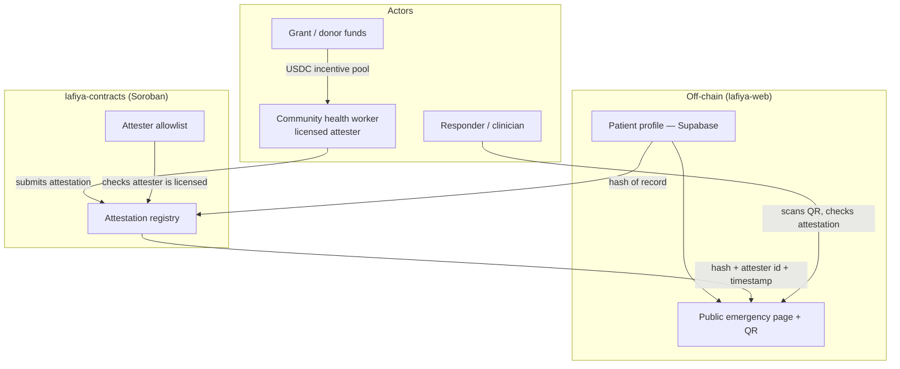

# Lafiya 🔏

[](https://stellar.org)
[](https://soroban.stellar.org)
[]()
[]()
[](https://github.com/Lafiya-xyz/Lafiya-contract/actions/workflows/ci.yml)
[](LICENSE)

Soroban smart contracts for Lafiya's on-chain trust layer — an attestation registry and attester allowlist that let a health worker's verification of an emergency health record be checked cryptographically, without the underlying health data ever touching the blockchain.

**Your vitals, verified. When you can't speak, Lafiya does.**

*Lafiya* is Hausa for health, safety, and wellbeing.

> **Status:** Pre-alpha · Stellar **testnet** · not yet audited · not a medical device. See [Disclaimer](#disclaimer).

## Overview

Lafiya is a free, patient-owned emergency health card: the handful of facts that change how you are treated in an emergency — blood group, genotype, allergies, current medications, chronic conditions — travel with you as a scannable QR code and can be **cryptographically verified** by a health worker so a first responder can trust them on the spot.

This repository (`lafiya-contracts`) contains only the Soroban smart contract layer. The patient-facing web app and the docs/threat-model materials live in separate repos — see [Lafiya Organization](#lafiya-organization) below.

### The Problem

In Nigeria, health records are paper, siloed per facility, and effectively lost the moment a patient moves, is referred, or arrives unconscious. In an emergency, the facts that decide treatment — especially **genotype** (AS/SS sickle-cell status), blood group, and drug allergies — are usually unknown to whoever is treating you, and wrong assumptions cost lives.

Even once that data is digitized (in `lafiya-web`), a responder still has no way to know whether a card's contents were ever checked by a real health worker. Without an independent, tamper-evident verification layer:

- **Responders can't trust the data** — anyone could edit a public emergency page, so a "verified" label is meaningless unless it's backed by something the patient (or an attacker) can't forge
- **Health workers have no portable proof of their verification work** — nothing links a specific attester to a specific record across systems
- **Community health workers (CHWs) can't be paid reliably** for last-mile registration and verification without a transparent, low-fee settlement rail

### What `lafiya-contracts` Does

- **Attests** — records, on-chain, that a licensed health worker verified a specific patient record at a specific time, without storing any health data itself
- **Allowlists** — maintains the set of health workers authorized to submit attestations, so a "verified" indicator on a card actually means something
- **Anchors trust** — gives `lafiya-web` and `lafiya-verifier` a single, independently checkable source of truth that a responder's QR scan can query directly

## Features

- **Attestation registry (Soroban)** — when a licensed health worker verifies a record, an on-chain attestation stores *a hash of the record + the attester's identity + a timestamp* — never the health data itself
- **Attester allowlist** — only allowlisted attesters can write to the registry, so verification can't be forged by an arbitrary wallet
- **Hash-only on-chain footprint** — personal data lives in `lafiya-web`'s encrypted, access-controlled off-chain database; Stellar holds only hashes, attestations, and payments
- **USDC incentive rails** — CHWs are paid micro-amounts on Stellar per verified registration; near-zero fees and stablecoin settlement make last-mile outreach economically viable
- **Transparent funding** — grant and donor funds flow on-chain into the CHW incentive pool, so every dollar maps to a countable number of verified cards

## Architecture



### Core Components

- **`attester-registry`** — the on-chain allowlist of health workers authorized to write attestations
- **`attestation-registry`** — the on-chain record of which attester verified which record hash, and when; calls into `attester-registry` on every write
- **`multisig-account`** — a reusable N-of-M Soroban account contract that secures both registries' admin authorization

All three are implemented and unit-tested (target milestone **M1**, see [Roadmap](#roadmap)); none has been deployed to testnet yet.

## Smart Contract Layer

Three Soroban contracts, each in its own crate under `contracts/`.

**Design principle:** no personal health data ever touches the blockchain. Personal data lives in `lafiya-web`'s encrypted, access-controlled off-chain database. Stellar holds only hashes, attestations, and payments. This is what keeps Lafiya both privacy-respecting and regulator-compatible.

### `attester-registry`

| Function | Description |
| --- | --- |
| `initialize(admin: Address)` | Sets the admin. Callable once. |
| `propose_admin(new_admin: Address)` | Proposes a new admin. Requires admin auth. |
| `accept_admin()` | Finalizes the admin transfer. Requires proposed/pending admin auth. Emits `AdminTransferred`. |
| `add_attester(attester: Address)` | Allowlists `attester`. Requires admin auth. Emits `AttesterAdded`. |
| `remove_attester(attester: Address)` | Removes `attester` from the allowlist. Requires admin auth. Emits `AttesterRemoved`. |
| `is_attester(attester: Address) -> bool` | Whether `attester` is currently allowlisted. Open to any caller, including other contracts. |
| `get_attester_info(attester: Address) -> Option<AttesterInfo>` | Returns stored metadata for an allowlisted attester. |

### `attestation-registry`

| Function | Description |
| --- | --- |
| `initialize(admin: Address, attester_registry: Address)` | Sets the admin and the `attester-registry` contract to consult. Callable once. |
| `propose_admin(new_admin: Address)` | Proposes a new admin. Requires admin auth. |
| `accept_admin()` | Finalizes the admin transfer. Requires proposed/pending admin auth. Emits `AdminTransferred`. |
| `attest(attester: Address, record_hash: BytesN<32>) -> Attestation` | Requires `attester`'s auth and that `attester` is allowlisted (checked via a cross-contract call to `attester-registry::is_attester`). Stores `{ attester, timestamp }` keyed by `record_hash`, overwriting any prior attestation for that hash. Emits `AttestationRecorded`. |
| `get_attestation(record_hash: BytesN<32>) -> Option<Attestation>` | Looks up the latest attestation for a record hash. Open to any caller — this is what lets a responder's QR scan verify a card without an external oracle. |

### `multisig-account`

| Function | Description |
| --- | --- |
| `__constructor(signers: Vec<BytesN<32>>, threshold: u32)` | Configures the ed25519 signer set and required N-of-M threshold at deployment. |
| `__check_auth(...)` | Verifies ordered, unique signatures from configured signers whenever another contract calls `require_auth()` for this account address. |

`attestation-registry` calls `attester-registry` through a local `#[contractclient]` trait interface (just `is_attester`), not a direct crate dependency — depending on the whole crate would link `attester-registry`'s own contract implementation into `attestation-registry`'s wasm build too, which is both wasted size and, at least on the Soroban SDK version this repo pins, produces a linker warning from the two contracts' colliding `initialize` exports.

## Repository Structure

```
bindings/
├── attestation-registry/    # generated TS client for attestation contract
└── attester-registry/       # generated TS client for allowlist contract
contracts/
├── multisig-account/        # reusable N-of-M admin account
│   ├── Cargo.toml
│   └── src/
│       ├── lib.rs
│       ├── test.rs
│       └── integration_test.rs
├── attester-registry/       # allowlist contract
│   ├── Cargo.toml
│   └── src/
│       ├── lib.rs           # initialize, add_attester, remove_attester, is_attester
│       └── test.rs
└── attestation-registry/    # attestation contract
    ├── Cargo.toml
    └── src/
        ├── lib.rs           # initialize, attest, get_attestation
        └── test.rs
Cargo.toml                   # workspace + release profile
Cargo.lock                    # committed for reproducible builds
rust-toolchain.toml           # pins stable + wasm32v1-none
Makefile                      # build/test/fmt/clippy/wasm/bindings/check
.github/workflows/ci.yml      # runs the same checks on push/PR
LICENSE                       # MIT
CONTRIBUTING.md               # local dev workflow
```

## TypeScript Client Bindings

Client bindings are generated from the built WASM contracts using the `stellar-cli` tool. They allow frontend applications (like `lafiya-web`) to interact with the deployed contracts with full type safety.

### Generation

To generate the bindings, run:

```bash
make bindings
```

This builds the contracts and outputs TypeScript packages to the `bindings/` directory:
- `bindings/attester-registry`
- `bindings/attestation-registry`

To compile the generated packages:

```bash
cd bindings/attester-registry && npm install && npm run build
cd ../attestation-registry && npm install && npm run build
```

### Publishing & Consumption

The generated bindings are committed directly to this repository under the `bindings/` directory. `lafiya-web` (or any other consumer) can consume them via:
- Direct git path dependency in `package.json` pointing to the repo or subdirectory.
- A git submodule in the consuming project.
- Alternatively, CI/CD can be configured to publish these directories as packages to the `@lafiya` npm organization.


## Tech Stack

- **On-chain:** Soroban smart contracts (Rust), `soroban-sdk` 25.x, on Stellar; USDC on Stellar for CHW payments
- **Network:** Stellar testnet first
- **Standards informing design:** W3C Verifiable Credentials data model (issuer/holder/verifier roles, hash-based attestation)

## Getting Started

```bash
git clone https://github.com/Lafiya-xyz/Lafiya-contract.git
cd Lafiya-contract
rustup target add wasm32v1-none   # also picked up automatically via rust-toolchain.toml
make check                        # fmt-check + clippy + test + wasm build
```

### Recommended admin setup

Deploy `multisig-account` first with the ed25519 public keys of all M administrators and the required threshold N. For example, three signer keys with a threshold of two creates a 2-of-3 admin account. Keep the signer keys in separate custody and order submitted signatures by public key.

Use the deployed multisig contract address as `admin` when initializing both registries:

```text
attester-registry.initialize(multisig_address)
attestation-registry.initialize(multisig_address, attester_registry_address)
```

The registry contracts need no multisig-specific logic. Their existing `admin.require_auth()` calls invoke the account contract's `__check_auth`, so an admin operation succeeds only when its authorization entry contains at least N valid signatures.

Not yet deployed to testnet — deployment scripts and instructions land with the rest of milestone M1.

## Privacy & Compliance

- **Nigeria Data Protection Act (2023)** governs all personal data held across the Lafiya project. Consent, encryption, and minimal disclosure are designed in from day one.
- No health data is ever written on-chain — only non-reversible hashes and attestations, by design (see [Smart Contract Layer](#smart-contract-layer)).

## Roadmap

- **M0 — Public card (testnet).** One patient can create a profile and expose a working read-only emergency page via QR. *(`lafiya-web`)*
- **M1 — Attestation.** Soroban registry lets an allowlisted attester verify a record; the card shows a verified indicator. **← this repo** — contracts implemented and unit-tested; testnet deployment and `lafiya-web` integration still open.
- **M2 — Incentives.** USDC-on-Stellar payout to a CHW per verified registration.
- **M3 — Pilot.** Small supervised field pilot; measure verified cards created and scan events.
- **M4 — Mainnet + funding.** Launch on mainnet; open transparent funding pool.

## Why This Matters for the Stellar Ecosystem

Stellar/Soroban does two things Lafiya genuinely needs that a plain web app cannot: it makes verification **tamper-evident and independently checkable** without exposing data, and it moves **stablecoin micropayments** to health workers cheaply and across borders. Remove Stellar and the trust layer and the incentive engine both disappear — Soroban is core to Lafiya, not shoehorned in.

## Testing

```bash
make test
```

Covers, per contract (see `contracts/*/src/test.rs`):

- ✅ Initialize / double-initialize rejection
- ✅ Admin-gated writes (`add_attester`, `remove_attester`), including rejection when the caller's auth entry doesn't match
- ✅ Allowlist lookups (`is_attester`)
- ✅ `attest` by an allowlisted vs. non-allowlisted attester, and before the contract is initialized
- ✅ `get_attestation` lookups, including unknown hashes and re-attestation overwrite
- ✅ Emitted events (`AttesterAdded`, `AttesterRemoved`, `AttestationRecorded`)
- ✅ Multisig threshold, signer validation, signature ordering, and invalid-signature rejection
- ✅ Multisig-backed initialization and admin operations through the contract-account authorization path

Not yet covered: testnet deployment / integration testing against a live Soroban RPC, and the attester allowlist growing large enough to matter for storage TTL/cost.

## Dependencies

- Rust (stable) + `wasm32v1-none` target — see `rust-toolchain.toml`
- `soroban-sdk` 25.x
- Stellar testnet account and USDC trustline, once deployment scripts land

## License

[MIT](LICENSE).

## Contributing

See [CONTRIBUTING.md](CONTRIBUTING.md) for the local dev workflow (`make check` etc.). Issues and PRs welcome. This repository specifically needs collaborators with experience in:

- Stellar / Soroban smart contract development (Rust)
- On-chain data modeling and attestation/verifiable-credential design

## Lafiya Organization

This repo is one of five in the `lafiya-xyz` organization.

| Repo                  | URL | Purpose                                                                                              | Priority                 |
| ---------------------- | --- | ----------------------------------------------------------------------------------------------------- | ------------------------- |
| `lafiya-web`           | [github.com/Lafiya-xyz/lafiya-web](https://github.com/Lafiya-xyz/lafiya-web) | Patient + responder web app (Next.js). Public emergency page, authed profile editor, QR generation.    | Build first               |
| **`lafiya-contracts`** _(this repo)_ | [github.com/Lafiya-xyz/Lafiya-contract](https://github.com/Lafiya-xyz/Lafiya-contract) | Soroban smart contracts (Rust): attestation registry + attester allowlist. Testnet first. | **Build next**            |
| `lafiya-docs`          | [github.com/Lafiya-xyz/lafiya-docs](https://github.com/Lafiya-xyz/lafiya-docs) | Concept note, data model, threat model, privacy design, funding/DPG materials, references.             | Start now (lightweight)   |
| `.github`              | [github.com/Lafiya-xyz/.github](https://github.com/Lafiya-xyz/.github) | Organization profile README and contribution guidelines.                                               | Start now                 |
| `lafiya-verifier`      | [github.com/Lafiya-xyz/lafiya-verifier](https://github.com/Lafiya-xyz/lafiya-verifier) | CHW verification tool. Begins as a route inside `lafiya-web`; split out only if it grows.               | Later                     |

> Resist scaffolding empty repos. Two working repos (`lafiya-web`, `lafiya-contracts`) beat five half-built ones. Build one honest milestone at a time.

### Data Flow

```
lafiya-web  ──(record hash)──▶  lafiya-contracts
                                       │
        CHW attests ──(licensed?)──▶  │  (attester allowlist check)
                                       ▼
                          attestation: hash + attester id + timestamp
                                       │
                                       ▼
                              lafiya-web public emergency page
                                       │
                                       ▼
                         responder scans QR, sees verified indicator
```

1. **`lafiya-web`** holds the patient's private profile and computes a hash of the emergency-relevant record.
2. A licensed CHW, verified against the **attester allowlist**, submits an attestation to the **attestation registry** in this repo — a hash, the attester's identity, and a timestamp, never the health data itself.
3. **`lafiya-web`**'s public emergency page reads the attestation to show a verified indicator; a responder scanning the QR can independently trust it without an external oracle.
4. **`lafiya-verifier`** (later) gives CHWs a dedicated flow for step 2 as it splits out of `lafiya-web`.

### Shared Contracts (must stay in sync across repos)

**Attestation schema** — a hash of the record + the attester's identity + a timestamp, defined by the contracts in this repo and consumed by `lafiya-web`'s public emergency page. If the shape of an attestation changes here, `lafiya-web`'s verification-display logic must be updated in the same change set (or a tracked follow-up opened there).

### Conventions for AI Agents

- Treat this section as the source of truth for **cross-repo** contracts. Each repo's own README covers repo-local conventions.
- The contracts are implemented and unit-tested but not yet deployed to testnet — don't assume a live contract ID or deployment scripts exist; check [Repository Structure](#repository-structure) before referencing a path.
- When a change here affects the attestation schema or either contract's function signatures, call it out explicitly so `lafiya-web` can be updated to match.

## Support

For issues and questions:

- GitHub Issues: [Create an issue](https://github.com/Lafiya-xyz/Lafiya-contract/issues)

## Disclaimer

Lafiya is an information aid, **not a medical device** and **not a substitute for professional medical judgment**. Verified indicators reflect that a record was attested by a registered health worker; they are not a clinical guarantee. Treatment decisions remain the responsibility of the attending clinician.

## References

These works directly informed Lafiya's design and are the intended reading for contributors, particularly the attestation/trust-layer work in this repo.

**Books**

- Preukschat, A., & Reed, D. (2021). *Self-Sovereign Identity: Decentralized Digital Identity and Verifiable Credentials*. Manning. — The blueprint for Lafiya's attestation layer: issuer/holder/verifier roles, verifiable credentials, hash-based attestation, key management, and offline verification.
- Kleppmann, M. (2017). *Designing Data-Intensive Applications*. O'Reilly. — Informs the boundary between what lives in the off-chain database and what is anchored on-chain.
- Martin, R. C. (2017). *Clean Architecture: A Craftsman's Guide to Software Structure and Design*. Prentice Hall. — Discipline for an AI-assisted codebase: clear boundaries so the contracts, app, and data layer stay independently maintainable.
- Shortliffe, E. H., & Cimino, J. J. (Eds.). (2021). *Biomedical Informatics: Computer Applications in Health Care and Biomedicine* (5th ed.). Springer. — Grounds which fields are decision-relevant in an emergency, informing what a record hash here actually represents.
- Toyama, K. (2015). *Geek Heresy: Rescuing Social Change from the Cult of Technology*. PublicAffairs. — Keeps the project honest: the attestation layer amplifies trust in community health workers rather than replacing them.

**Standards & documentation**

- Stellar Development Foundation — Stellar and Soroban developer documentation.
- W3C — Verifiable Credentials Data Model.
- Nigeria Data Protection Act (2023) — Nigeria Data Protection Commission.
- Digital Public Goods Alliance — DPG Standard.

---

<div align="center">

**Lafiya** — Your vitals, verified.

_Built for the Stellar ecosystem. Open source. Community owned._

</div>
